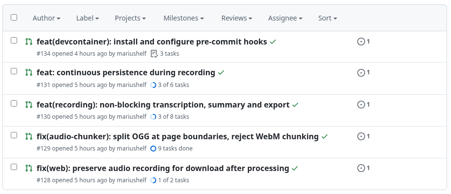

# swe-tools

A curated collection of software engineering skills for Claude Code.

Beta: use at your own risk and provide feedback!

## Skills

### design-advisor

Spawn a 4-person agent team (architect, UX advocate, domain expert, devil's advocate) to advise on architecture, plan a solution, or review a proposed change — before any code is written.

**Modes:**
- `critique:` — open-ended architecture critique
- `plan:` — design a solution for a stated goal
- `review:` — evaluate a specific proposed change

**Usage:** `/design-advisor critique: the auth middleware's separation of concerns`

### working-on-parallel-issues

Orchestrate multiple GitHub issues in parallel — one worktree-isolated agent per issue, each producing a PR with green CI.

The orchestrator avoids merge conflicts by serialising tasks that are likely to conflict
with each other.

Recommended to run in a dev container or other isolated environment with
`--dangerously-skip-permission` to allow for fully autonomous operation.

**Usage:** `/working-on-parallel-issues 128 129 130 131 134`

**Note:** Requires the [superpowers](https://github.com/obra/superpowers) plugin for the `dispatching-parallel-agents` orchestration pattern.

**Output**




## Installation

From the command line:

```bash
claude plugin marketplace add mariushelf/claude-swe-tools
claude plugin install swe-tools@claude-swe-tools
```

Or interactively inside Claude Code:

```
/plugin marketplace add mariushelf/claude-swe-tools
/plugin install swe-tools@claude-swe-tools
```

## License

MIT
