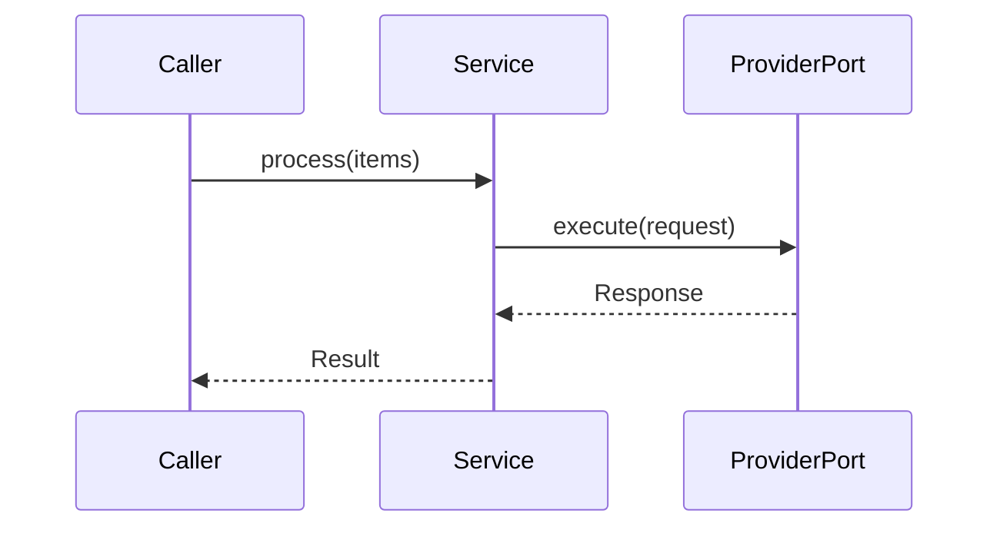

PROJECT_CONTEXT: $PROJECT_CONTEXT
FINDING: $FINDING          (the DOC_AUDIT.md entry driving this page)
PAGE_TYPE: $PAGE_TYPE      (concept | architecture)
TARGET_PATH: $TARGET_PATH  (docs/source-root-absolute path, e.g. concepts/clustering.md)

YOUR ROLE: Author of one explanation page. Read-then-write. Generate a
single `.md` file at `$TARGET_PATH`. Do not create any other files.

Follow `assets/meta/voice.md` rules 1–7 in every sentence you write.
Follow `assets/meta/writing_documentation.md` for the procedural steps.

---

## Page shapes

Write flowing prose, not a template skeleton of named headings. Choose
one shape based on `$PAGE_TYPE`:

### concept page

Cover these ingredients in natural sequence:

1. **Concept and mental model.** What it is. Where the boundary sits
   between this concept and adjacent ones. Use one precise definition,
   not a list of synonyms.
2. **Where it is used.** Enumerate the contexts or subsystems that rely
   on it. Link to the relevant how-to guide: `` {doc}`/guides/...` ``.
3. **How it is built.** A paragraph orienting the reader toward the
   implementation — what module, what class, what collaboration. Link
   *down* to the architecture page: `` {doc}`/architecture/...` ``.
4. **Decisions.** The trade-offs that shaped this concept. Link to the
   relevant ADRs: `` {doc}`/adr/...` ``.

### architecture / implementation page

Cover these ingredients:

1. **Conceptual anchor.** One sentence orienting the reader — link *up*
   to the concept page: `` {doc}`/concepts/...` ``.
2. **Where it lives.** Module path(s) and the entry-point symbol, with
   `file:line` references (e.g. `src/your_package/adapters/client.py:42`).
3. **How it is built.** Internal types, their roles, and how they
   collaborate. State invariants that must hold.
4. **The replacement seam** — only if the project exposes one. If a
   port, protocol, or interface boundary separates this implementation
   from its callers, describe it and cite `file:line` for the boundary
   definition and any registered implementations. If the project has no
   such seam, omit this ingredient; do not invent one.
5. **Edge cases.** Non-obvious limits, failure modes, and what the
   code does in each.
6. **ADR cross-references.** Any decisions recorded in `adr/` that
   explain this implementation's shape.

---

## Diagrams

Every architecture page must include both diagrams below. Concept pages
include them only when they aid the mental model.

**Flowchart** — component relationships and static structure:


**Sequence diagram** — the primary request or workflow:



Replace the placeholder participants and messages with the actual ones
for this page. Keep diagrams minimal — show the key collaborators, not
every field.

---

## Authoring rules

- Ground every factual claim in a `file:line` reference. If a claim
  cannot be grounded, do not make it.
- Describe what the code does today, in present tense.
- If the codebase or the finding mentions designed-but-unbuilt behavior,
  label it with a self-contained `{caution}` admonition that states
  inline what is unbuilt and why, citing the evidence or its absence
  (one or two sentences; no links to plan or ledger files):

  ```{caution}
  Designed but not implemented: <what>. <Where the design appears and
  why the code does not yet do this, e.g. "described in the module
  docstring at file:line, but no implementation exists">.
  ```

- Cross-reference in-tree pages with the MyST `{doc}` role and
  source-root-absolute docnames:
  `` {doc}`/concepts/cache` `` (not a relative path, not a URL).
- Never fabricate ADR rationale. If no ADR exists for a decision,
  omit the ADR cross-reference.
- Do not add a page-level `## Contents` or `## Overview` heading; start
  directly with the first ingredient.

OUTPUT: Write the completed `.md` file to `$TARGET_PATH`. No other
files. No summary prose outside the file.
